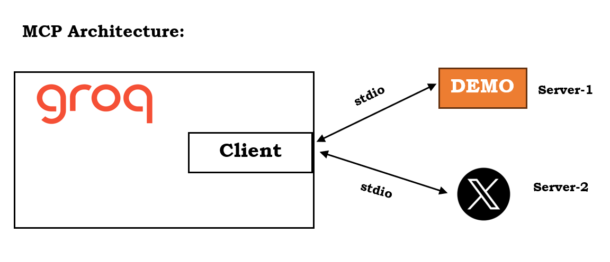

## The code follows the following MCP Architecture 🧰 ## 

 
  

---
## 🗄️ Servers used in the code:
<ol type = "1">
  <li>
    
Demo Server (Involves tools like add, sub, predict_age)

  </li>
  <li>
    
X Server (send and read tweets on X.com)

  </li>
</ol>

---
## 🔑 Key Requirements ## 
<ul>
  <li>
    
<b>Login to X.com and and create api key and thereby give R-W permission</b>

  </li>
  <li>
    
<b>Groq API Key</b>

  </li> 
</ul>

---

  <i>Please Note: It is a multiserver mcp client | Feel free to use!</i>

